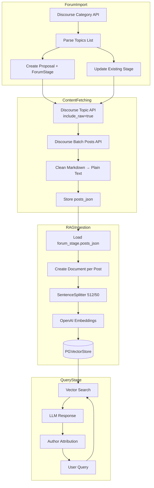

# Forum Content Enrichment – Implementation Guide

**Status:** ✅ Implemented
**Date:** 2026-02-02 (initially documented as gap, completed same day)
**Last Updated:** 2026-02-03

This document explains the Forum Content Enrichment feature that extends the Proposal RAG system to include full forum post content (original posts and comments) for semantic search. It covers design decisions, implementation details, and the end-to-end flow.

## Background

Initially, the forum import only fetched **topic-level metadata** from the Discourse category list API (`/c/proposals/7.json`). This provided basic information like title, author, post count, and last activity timestamp, but did not include the actual post content or comments.

To enable semantic search and AI-powered queries like "What concerns did delegates raise about proposal X?", we needed to:
1. Fetch individual post content from each topic (`/t/{topic_id}.json`)
2. Clean and normalize the markdown content
3. Store posts in the database
4. Ingest them into the RAG vector store

This feature bridges that gap, transforming the system from metadata-only to full-content search.

## Why These Choices

### Store Posts in `forum_stage` Table
- We extended the existing `forum_stage` table rather than creating a new table to keep queries simple and avoid JOINs during RAG ingestion.
- The `posts_json` JSONB column provides flexibility for schema evolution without migrations.
- All forum-related data stays in one place, following the existing pattern where each stage table owns its data.

### Unified `posts_json` Field
- The original plan had separate `original_post_body` and `comments_json` fields.
- We consolidated into a single `posts_json` array where `post_number=1` is the original post and `post_number>1` are comments.
- This simplifies the data model and allows treating all posts uniformly for RAG ingestion.

### IPv4-Forced HTTPS Requests
- Node.js `fetch()` API caused ETIMEDOUT errors on networks with IPv6 connectivity issues.
- We switched to native `https` module with `family: 4` to force IPv4 connections.
- This matches how `curl` successfully connects after IPv6 fails.

### Content Cleaning Pipeline
- Forum posts contain Discourse-specific markdown, HTML, and formatting that adds noise to embeddings.
- We strip quotes, polls, spoilers, and convert markdown to plain text using `remove-markdown`.
- Clean text produces better embeddings and cleaner LLM context.

### Per-Post Documents for RAG
- Instead of embedding all posts into one large proposal document, we create one document per post.
- This enables fine-grained attribution ("Who said X on proposal Y?").
- Each post gets its own embedding, improving retrieval precision for specific comments.

### Smart Update Detection
- Content is only re-fetched when `posts_count` changes or `last_posted_at` is newer than `content_fetched_at`.
- A 1-hour debounce prevents excessive re-fetching for recently synced content.
- Failed fetches use exponential backoff (5min → 80min) with max 5 retries before dead-lettering.

## High-Level Flow

1. **Forum Import** fetches topic metadata from Discourse API and stores in `forum_stage`.
2. **Content Fetch** retrieves full post content (markdown) for each topic via `include_raw=true`.
3. **Content Cleaning** converts markdown to plain text, removing Discourse syntax.
4. **Storage** saves cleaned posts to `forum_stage.posts_json` with fetch status tracking.
5. **RAG Ingestion** creates per-post documents with author attribution metadata.
6. **Query** retrieves relevant posts and cites specific authors in responses.

## End-to-End Flow Diagram



## Database Schema Changes

The `forum_stage` table was extended with these columns:

```sql
-- Content storage
posts_json JSONB                    -- Array of ForumPost objects
content_fetched_at TIMESTAMP        -- When content was last fetched
content_fetch_status VARCHAR(20)    -- 'pending' | 'success' | 'failed' | 'partial'

-- Retry tracking
last_fetched_post_count INTEGER     -- Post count at last successful fetch
fetch_error_log TEXT                -- Error message for failed fetches
fetch_retry_count INTEGER           -- Number of retry attempts
next_fetch_attempt TIMESTAMP        -- When to retry after backoff
```

### ForumPost JSON Schema

Each item in `posts_json` follows this structure:

```typescript
type ForumPost = {
  id: number;                       // Discourse post ID
  post_number: number;              // 1 = OP, 2+ = comments
  author_name: string;              // Display name
  author_username: string;          // @username
  content: string;                  // Cleaned plain text (max 50k chars)
  posted_at: string;                // ISO 8601 timestamp
  reply_to_post_number?: number;    // For threaded replies
  is_deleted?: boolean;             // Soft-deleted posts
};
```

## File Structure

### Forum Services

| File | Purpose |
|------|---------|
| `services/forum/http.ts` | IPv4-forced HTTPS utility with retry logic |
| `services/forum/content.ts` | Topic content fetching and markdown cleaning |
| `services/forum/import.ts` | Forum import pipeline with content integration |
| `services/forum/types.ts` | Zod schemas for Discourse API and ForumPost |

### Database

| File | Purpose |
|------|---------|
| `services/database/config/schema.ts` | Drizzle schema with new forum_stage columns |
| `services/database/repositories/forum.ts` | Repository functions for content updates |

### RAG Services

| File | Purpose |
|------|---------|
| `services/rag/types.ts` | Extended metadata with post_number, author_name, content_type |
| `services/rag/documentBuilder.ts` | Per-post document creation with attribution |
| `services/rag/ingestion.ts` | Forum document ingestion with chunking |

## HTTP Utility (IPv4-Forced)

The `http.ts` module provides `httpsGet()` that forces IPv4 connections:

```typescript
// Key configuration that fixes IPv6 timeout issues
const request = https.get(url, {
  headers: { 'User-Agent': 'arbitrum-dashboard/1.0' },
  timeout: 30000,
  family: 4,  // Force IPv4
}, callback);
```

Features:
- **Forced IPv4**: Bypasses IPv6 timeout issues on certain networks
- **Retry Logic**: 3 attempts with exponential backoff (1s → 2s → 4s)
- **Timeout Handling**: 30-second default timeout with proper cleanup
- **JSON Parsing**: Automatic response parsing with error handling

## Content Fetching Pipeline

### Discourse API Endpoints

The implementation uses two Discourse API endpoints:

### Category List (Metadata Only)
```bash
GET https://forum.arbitrum.foundation/c/proposals/7.json?page={page}
```

**What this provides:**
- Topic list with basic metadata (id, title, slug, posts_count)
- Author information (via posters array)
- Activity timestamps (last_posted_at)
- **Does NOT include:** actual post content, comment text, or discussion details

This is used by the forum import service to discover topics and maintain the topic list.

### Individual Topic (Full Content)
```bash
GET https://forum.arbitrum.foundation/t/{topic_id}.json?include_raw=true
```

**What this provides:**
- Complete topic metadata
- First batch of posts (usually 20) with **full markdown content**
- Post stream with all post IDs
- `include_raw=true` is **CRITICAL** - without it, the `raw` field (markdown) is `null`

**Response structure:**
```json
{
  "id": 22956,
  "title": "...",
  "posts_count": 42,
  "post_stream": {
    "posts": [
      {
        "id": 47319,
        "post_number": 1,
        "username": "Sinkas",
        "name": "Anastassis Oikonomopoulos",
        "raw": "## TL;DR\n\nThe markdown content...",
        "cooked": "<h2>TL;DR</h2><p>The HTML version...</p>",
        "created_at": "2024-04-01T17:21:16.474Z",
        "reply_to_post_number": null
      }
    ],
    "stream": [47319, 47347, 47382, ...]
  }
}
```

### Batch Posts (Remaining Content)
```bash
GET https://forum.arbitrum.foundation/t/{topic_id}/posts.json?post_ids[]={id}&include_raw=true
```

**What this provides:**
- Fetches additional posts beyond the first batch
- Discourse returns max 20 posts per topic endpoint, so longer discussions require batch fetching
- Posts are fetched in batches of 20 with 100ms delay between requests
- Same post structure as individual topic endpoint

### Content Cleaning

The `cleanForumContent()` function transforms raw markdown:

```typescript
function cleanForumContent(rawMarkdown: string): string {
  // 1. Remove Discourse-specific syntax
  cleaned = rawMarkdown
    .replace(/\[quote=...\]...\[\/quote\]/g, ' ')  // Quotes
    .replace(/\[poll...\]...\[\/poll\]/g, '[poll]') // Polls
    .replace(/\[spoiler\]...\[\/spoiler\]/g, '')    // Spoilers
    .replace(/\[details=...\]...\[\/details\]/g, ''); // Details

  // 2. Convert markdown to plain text
  text = removeMarkdown(cleaned, { gfm: true });

  // 3. Normalize whitespace
  text = text.replace(/\n{3,}/g, '\n\n').trim();

  // 4. Enforce 50k char limit
  if (text.length > 50000) {
    text = text.substring(0, 50000) + '\n\n[... content truncated]';
  }

  return text;
}
```

## Smart Update Logic

The `shouldUpdateForumContent()` function determines when to re-fetch:

```typescript
function shouldUpdateForumContent(forumStage, topic): boolean {
  // Always fetch if never fetched
  if (!forumStage.content_fetched_at) return true;

  // Fetch if post count changed
  if (topic.posts_count !== forumStage.last_fetched_post_count) return true;

  // Fetch if there's new activity
  if (new Date(topic.last_posted_at) > forumStage.content_fetched_at) return true;

  // Debounce: skip if fetched within 1 hour and successful
  if (forumStage.content_fetch_status === 'success') {
    const hoursSince = (Date.now() - fetched) / 3600000;
    if (hoursSince < 1) return false;
  }

  return false;
}
```

### Retry Logic with Exponential Backoff

Failed fetches are scheduled for retry:

| Attempt | Backoff | Next Attempt |
|---------|---------|--------------|
| 1 | 5 min | 5 min from now |
| 2 | 10 min | 10 min from now |
| 3 | 20 min | 20 min from now |
| 4 | 40 min | 40 min from now |
| 5 | 80 min | Dead-lettered (skipped) |

## RAG Document Building

### Per-Post Documents

Each forum post becomes a separate document:

```typescript
function createDocumentsFromForumStage(proposal: ProposalWithForumContent): Document[] {
  return proposal.forum.posts.map(post => new Document({
    id_: `${proposal.id}__forum__${post.post_number}`,
    text: post.content,
    metadata: {
      proposal_id: proposal.id,
      stage: 'forum',
      post_number: post.post_number,
      author_name: post.author_name,
      author_username: post.author_username,
      content_type: post.post_number === 1 ? 'original' : 'comment',
      posted_at: post.posted_at,
      url: `${proposal.forum.url}/${post.post_number}`,
    }
  }));
}
```

### Metadata Schema

The `RagNodeMetadata` type includes forum-specific fields:

```typescript
type RagNodeMetadata = {
  // Base fields
  proposal_id: string;
  stage: 'forum' | 'snapshot' | 'tally';
  url: string;

  // Forum-specific fields
  post_number?: number;           // 1 = OP, 2+ = comment
  author_name?: string;           // For "who said X" queries
  author_username?: string;       // @username
  content_type?: 'original' | 'comment';
  posted_at?: string;             // For temporal filtering
  reply_to_post_number?: number;  // Thread context

  // Chunking metadata
  chunk_index?: number;
  total_chunks?: number;
};
```

### Chunking Strategy

Posts exceeding 512 tokens are split using LlamaIndex `SentenceSplitter`:

```typescript
const splitter = new SentenceSplitter({
  chunkSize: 512,    // tokens
  chunkOverlap: 50,  // tokens
});

// Only add chunk metadata for multi-chunk posts
if (tokenCount > 512 && chunks.length > 1) {
  chunks.forEach((chunk, idx) => {
    chunk.metadata.chunk_index = idx;
    chunk.metadata.total_chunks = chunks.length;
  });
}
```

## Import Summary Statistics

The `importForumPosts()` function returns detailed statistics:

```typescript
type ImportSummary = {
  pagesFetched: number;         // API pages processed
  topicsSeen: number;           // Total topics encountered
  newTopics: number;            // New proposals created
  existingTopics: number;       // Existing proposals updated
  proposalsCreated: number;     // New proposal records
  forumStagesCreated: number;   // New forum_stage records
  forumStagesUpdated: number;   // Updated forum_stage records
  contentFetchSuccess: number;  // Successful content fetches
  contentFetchPartial: number;  // Partial fetches (some batches failed)
  contentFetchFailed: number;   // Failed fetches
  stoppedOnPage: number | null; // Page where import stopped
  stoppedReason: string | null; // Why import stopped
};
```

## Configuration

### HTTP Settings (in `http.ts`)

| Setting | Value | Purpose |
|---------|-------|---------|
| `DEFAULT_TIMEOUT` | 30000ms | Request timeout |
| `MAX_RETRIES` | 3 | HTTP retry attempts |
| `RETRY_DELAY_MS` | 1000ms | Base delay for exponential backoff |

### Content Fetching (in `content.ts`)

| Setting | Value | Purpose |
|---------|-------|---------|
| `REQUEST_DELAY` | 100ms | Delay between batch requests |
| `BATCH_SIZE` | 20 | Posts per batch (Discourse max) |
| `MAX_CONTENT_LENGTH` | 50000 | Max chars per post |

### Import Settings (in `import.ts`)

| Setting | Value | Purpose |
|---------|-------|---------|
| `MAX_PAGES` | 100 | Max API pages to fetch |
| `REQUEST_DELAY` | 500ms | Delay between page fetches |
| `MAX_FETCH_RETRIES` | 5 | Content fetch retry limit |
| `BACKOFF_BASE_MINUTES` | 5 | Base backoff for failed fetches |

## Example Queries Enabled

With forum content enriched, users can ask:

| Query Type | Example |
|------------|---------|
| Attribution | "Who suggested extending the vesting period on the treasury proposal?" |
| Sentiment | "What were the main concerns raised about the token transfer?" |
| Summary | "Summarize the key arguments for and against proposal 42" |
| Search | "Which proposals discussed security audits?" |

## Running the Import

### Via API

```bash
curl -X POST http://localhost:3000/api/import-forum-posts \
  -H "Authorization: Bearer $CRON_SECRET"
```

### Expected Output

```
Fetching page 0...
Processing 30 topics from page 0
Created proposal: Example Proposal Title
Created forum stage: Example Proposal Title
✓ Topic 12345: 42 posts

Forum posts imported successfully
{
  "success": true,
  "summary": {
    "pagesFetched": 5,
    "topicsSeen": 150,
    "contentFetchSuccess": 148,
    "contentFetchFailed": 2
  }
}
```

## Implementation Decisions & Trade-offs

### Why Single `posts_json` Field vs Separate Table?

**Considered:** Creating a separate `forum_posts` table with foreign key to `forum_stage`

**Chose:** Single JSONB `posts_json` column in `forum_stage`

**Rationale:**
- Avoids JOINs during RAG ingestion (simpler queries)
- JSONB provides schema flexibility without migrations
- All forum-related data stays in one table (follows existing pattern)
- Sufficient for current use case (posts are loaded together for a proposal)
- Can always normalize later if query patterns change

### Why Per-Post Documents vs Single Proposal Document?

**Considered:** Embedding all posts into one large document per proposal

**Chose:** One document per post (post_number-based)

**Rationale:**
- Enables fine-grained attribution ("Who said X?")
- Better retrieval precision for specific comments
- Easier to handle long discussions (automatic chunking)
- Can filter by author, date, or comment vs original post

### Why IPv4-Forced HTTPS?

**Problem:** Node.js `fetch()` caused `ETIMEDOUT` errors on some networks

**Solution:** Native `https` module with `family: 4` to force IPv4

**Context:** IPv6 connectivity issues on certain network configurations caused timeouts. Forcing IPv4 matches successful `curl` behavior and resolves the issue completely.

## Known Gaps / Future Improvements

### Not Yet Implemented

- **Comment filtering**: Option to skip short comments (< 50 chars) or bot posts
  - Basic implementation exists via `skipShortComments` option, but not exposed in import pipeline
- **Edit history**: Only latest version is stored, not edit history
  - Discourse API provides `updated_at` but not version history
- **Deleted post handling**: Soft-deleted posts are skipped but not cleaned up
  - No mechanism to remove embeddings when posts are deleted upstream
- **Incremental RAG ingestion**: Currently re-ingests all documents
  - Could use content hashes to skip unchanged posts
- **Reply threading context**: Parent post content not included in child replies
  - Could enrich reply documents with parent context for better semantic understanding

### Recommended Enhancements

1. **Hash-based skip**: Use content hash to skip unchanged posts during ingestion
   - Partially implemented: content hash exists but not used for skip logic yet
2. **Scheduled sync**: Cron job to periodically fetch new content
   - Currently manual via API endpoint `/api/import-forum-posts`
3. **Reranking**: Add LlamaIndex postprocessor to rerank by author reputation
   - Could prioritize posts from known contributors or delegates
4. **Thread context**: Include parent post context for replies
   - Especially useful for short replies that reference earlier discussion
5. **Data volume monitoring**: Track embedding costs and storage growth
   - Forum discussions can be lengthy (50+ comments per proposal)
   - Need to validate cost/benefit of full ingestion vs sampling

## Evolution Notes

**2026-02-02 Morning:** Gap identified - forum import only fetching metadata, not actual post content. Documented limitation in gap analysis.

**2026-02-02 Same Day:** Decided to implement immediately rather than defer. Core concerns that led to implementation:
- Metadata-only RAG provides limited value for community discussion analysis
- Users expect to query "what did people say about X?" not just "how many comments were there?"
- Technical complexity was manageable (JSONB storage, existing Discourse API patterns)
- Cost concerns addressed by smart update logic (don't refetch unchanged content)

**2026-02-03:** Consolidated documentation - gap analysis served its purpose but became redundant after implementation.

## Related Documentation

- Design plans: `docs/plans/260130-01*-forum-content-enrichment*.md`
- RAG setup overview: `docs/rag-current-setup.md`
- Forum service types: `packages/nextjs/services/forum/types.ts`
- RAG metadata types: `packages/nextjs/services/rag/types.ts`

## Quick Reference: Testing the Implementation

### Check Database for Forum Content
```sql
-- See which proposals have forum content
SELECT
  p.title,
  fs.message_count,
  fs.content_fetch_status,
  jsonb_array_length(fs.posts_json) as posts_fetched,
  fs.content_fetched_at
FROM proposal p
JOIN forum_stage fs ON fs.proposal_id = p.id
WHERE fs.posts_json IS NOT NULL
ORDER BY fs.content_fetched_at DESC
LIMIT 10;
```

### Trigger Import via API
```bash
curl -X POST http://localhost:3000/api/import-forum-posts \
  -H "Authorization: Bearer $CRON_SECRET"
```

### Query RAG with Forum Content
```typescript
// Example query that leverages forum content
const response = await queryEngine.query({
  query: "What concerns were raised about the security audit in proposal X?"
});

// Response will include citations with:
// - author_name and author_username
// - post_number and content_type (original/comment)
// - Direct forum URLs to specific posts
```
