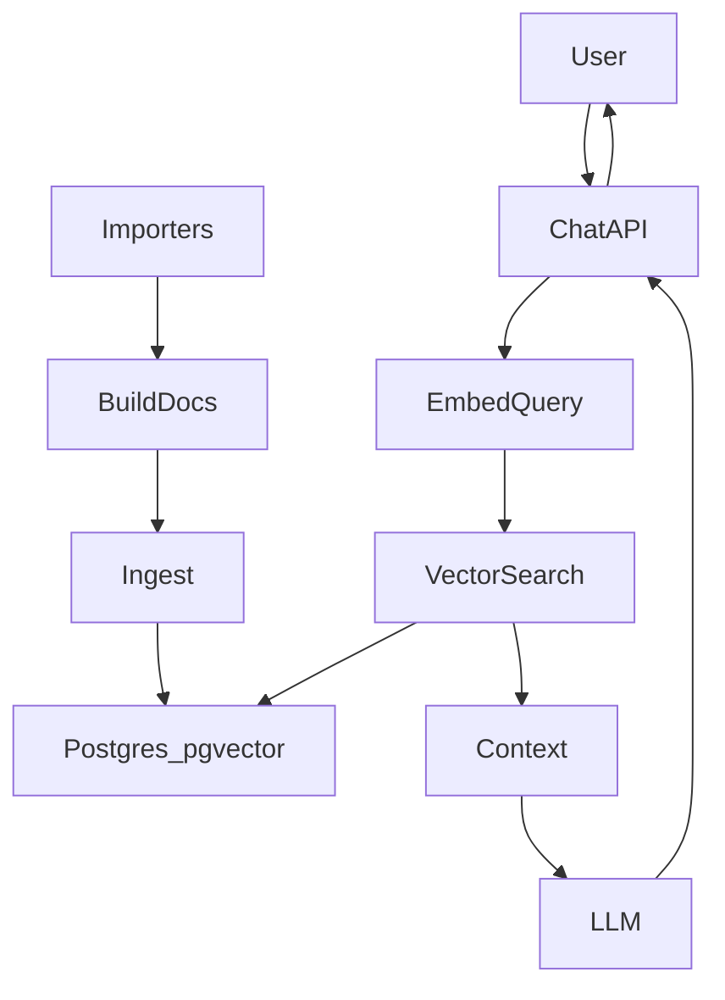
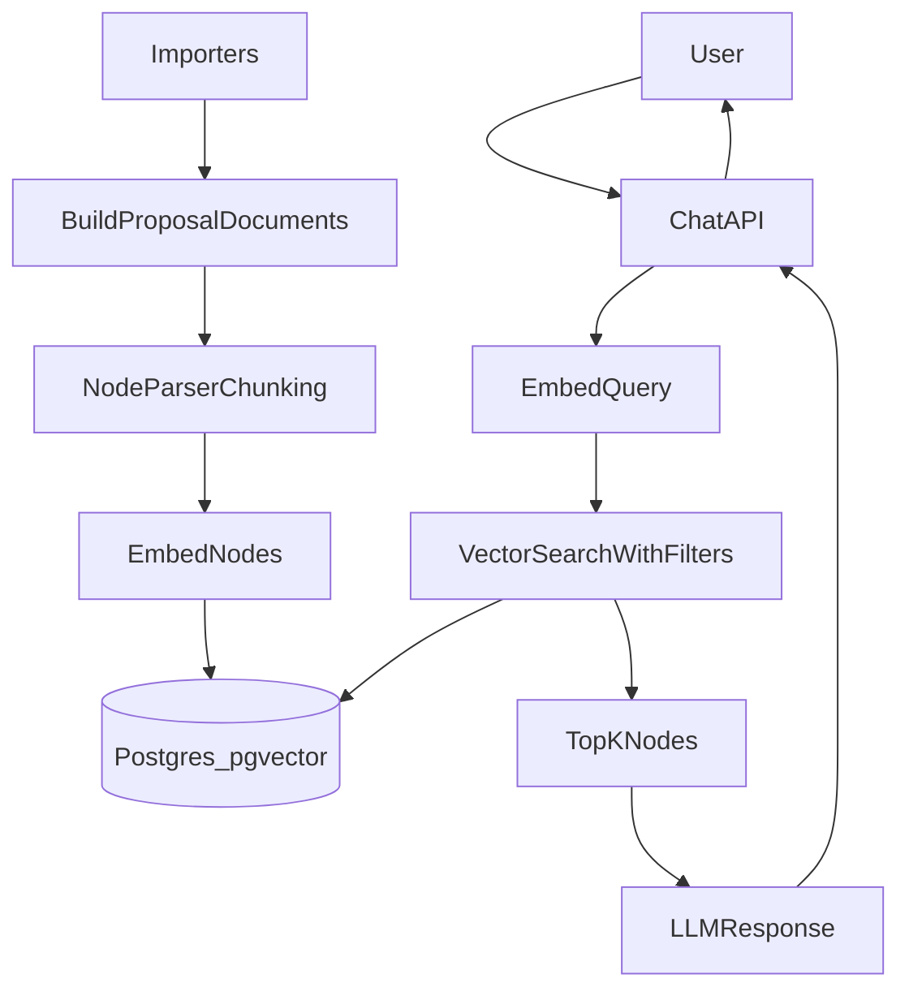

# Proposal RAG with LlamaIndex (Draft A)

## Requirements Prompt
- Enable semantic search and a future chatbot over proposals plus their stages (forum/snapshot/tally) using pgvector.
- Keep Neon (prod) and node-postgres (local) behavior consistent.
- Follow LlamaIndex conventions for ingestion and vector storage to reduce custom glue code.
- Build ingestion, retrieval API, and a minimal UI with citations.

## Clarifications
- Corpus: include full Snapshot body and forum content when available, in addition to proposal + stage summary.
- Ingestion: manual trigger only (no scheduled job in v1).
- Models: OpenAI embeddings + OpenAI LLM.
- Retrieval: top-K similarity with filters by stage/status.

## Goals
- Implement LlamaIndex-based RAG over proposals and stages with pgvector.
- Provide a Next.js API endpoint for natural language queries.
- Return answers with citations and proposal metadata.

## Non-Goals
- Automatic scheduled ingestion.
- Full evaluation harness or offline benchmarks.
- Streaming chat UI with multi-turn memory in v1.

## Architecture (high level)


## Data Sources
- `proposal` (canonical proposal)
- `forum_stage` (topic metadata + content link)
- `snapshot_stage` (snapshot metadata + body content)
- `tally_stage` (tally metadata)

## LlamaIndex Conventions
- Use the LlamaIndex Postgres/pgvector vector store so it creates and manages its own tables.
- Store proposal metadata in LlamaIndex metadata JSON (proposal_id, stage, status, url, timestamps).
- Vector index type: default to HNSW unless dataset size dictates IVFFLAT.

## Ingestion Pipeline (manual trigger)
1. Fetch proposal + stage rows.
2. Build a canonical document per proposal:
   - Title, author, category
   - Forum content + metadata
   - Snapshot body + status/voting window/options
   - Tally status + deadlines + options
3. Chunk documents (NodeParser) and attach metadata.
4. Embed chunks with OpenAI embeddings.
5. Write nodes into LlamaIndex vector store tables.

## Retrieval + Chat API
- Route: `app/api/rag/route.ts` (POST).
- Input: `{ query: string, filters?: { stage?: string[], status?: string[] }, topK?: number }`
- Process:
  - Embed query using OpenAI embeddings.
  - Retrieve top-K with LlamaIndex vector store and metadata filters.
  - Synthesize response via OpenAI LLM with citations.
- Output: `{ answer, citations: [{ proposal_id, stage, url, snippet }] }`

## UI (minimal)
- Add a simple admin page that posts to `/api/rag`.
- Display answer and citations, linking to proposal/stage URLs.

## Ops and Config
- Enable pgvector: `CREATE EXTENSION IF NOT EXISTS vector;`
- Env vars: `OPENAI_API_KEY`, `OPENAI_EMBEDDING_MODEL`, `OPENAI_CHAT_MODEL`, `RAG_TOP_K`.
- Manual trigger: admin button or CLI script to run ingestion/backfill.

## Risks
- Prompt injection via forum/snapshot content.
- Embedding cost for large corpus.
- Inconsistent metadata across stages.

## Test Plan
- Backfill a small subset and run sample queries.
- Verify filter behavior by stage/status.
- Confirm citations map to correct proposal IDs.

## References
- https://docs.llamaindex.ai
- https://neon.tech/docs/extensions/pgvector
- https://neon.tech/guides/vector-search
- https://neon.tech/guides/chatbot-astro-postgres-llamaindex
# Proposal RAG with LlamaIndex + pgvector (v1a)

Date: 2026-01-28  
Status: Draft (iteration a)

## Requirements Prompt
Build a RAG system over the proposals data model (`proposal`, `forum_stage`, `snapshot_stage`, `tally_stage`) to support NL queries and a future chatbot. Use Neon (prod) + node-postgres (local). Enable pgvector. Follow LlamaIndex conventions for ingestion and vector storage.

## Clarifications
1) Corpus: include full Snapshot body and forum content when available.  
2) Ingestion: manual trigger only (no scheduled or on-write automation in v1).  
3) Embedding/LLM: OpenAI embeddings + OpenAI LLM.  
4) Retrieval: top-K with filters by stage/status.

## Goals
- Enable semantic search over proposals and their stages.
- Use LlamaIndex conventions for ingestion and vector storage to minimize custom plumbing.
- Keep Neon and local Postgres behavior consistent.

## Non-Goals (v1)
- Autonomous agents or tool-calling workflows.
- Realtime streaming ingestion or auto-refresh.
- Hybrid keyword + vector search.

## Architecture (high level)


## Documentation Summary (key references)
- LlamaIndex TS: documents, nodes, vector store indexing, and retrievers.  
  https://next.ts.llamaindex.ai/docs/llamaindex  
- Neon pgvector extension and vector search patterns:  
  https://neon.tech/docs/extensions/pgvector  
  https://neon.tech/guides/vector-search  
- LlamaIndex + Neon guide (architecture pattern):  
  https://neon.tech/guides/chatbot-astro-postgres-llamaindex

## Data Model Changes (source data)
We need full text to embed. Current stage tables store titles and metadata only.

- Add long-form content fields:
  - `snapshot_stage.body` (from Snapshot GraphQL `body`)
  - `forum_stage.body` (first post content or topic summary)
- Ensure these are populated during import.

These are stored in the source tables for reproducibility, auditability, and to avoid re-fetching external APIs on every ingestion.

## Vector Store (LlamaIndex conventions)
- Use LlamaIndex’s Postgres/pgvector vector store implementation.
- Let LlamaIndex manage its own table(s) and column conventions.
- Store proposal metadata in each node’s metadata JSON:
  - `proposal_id`, `stage`, `status`, `url`, `author`, `created_at`
- Add vector index and JSONB metadata indexes as recommended by LlamaIndex/Neon docs.

## Ingestion Pipeline (manual trigger)
### Inputs
- `proposal` (core entity)
- `forum_stage`, `snapshot_stage`, `tally_stage` (stage metadata and body)

### Document assembly
Build a canonical text per proposal:
```
Title: ...
Author: ...
Category: ...

Forum Stage:
- Status: ...
- URL: ...
- Body: ...

Snapshot Stage:
- Status: ...
- Voting Window: ...
- Options: ...
- Body: ...

Tally Stage:
- Status/Substatus: ...
- Timeline: ...
- Options: ...
```

### Chunking and embedding
- Use LlamaIndex Document + NodeParser to chunk (e.g., 600–1000 tokens, overlap 50–100).
- Generate embeddings with OpenAI (e.g., `text-embedding-3-small`, 1536 dims).
- Write nodes to LlamaIndex’s vector store.

### Idempotency
Manual ingestion should be rerunnable:
- Use a stable `doc_id` per proposal (e.g., `proposal:{uuid}`).
- Include `content_hash` in metadata to detect changes.
- If content changes, delete existing nodes for `doc_id` before re-ingest.

## Retrieval + Chat API
### API behavior
- POST endpoint (e.g., `app/api/rag/route.ts`).
- Input: `{ query: string, filters?: { stage?: string; status?: string }, topK?: number }`
- Steps:
  1) Embed query using OpenAI.
  2) Retrieve top-K nodes with metadata filters (stage/status).
  3) Synthesize answer with LlamaIndex response synthesizer.
  4) Return answer + citations (node metadata + proposal_id).

### Retrieval policy
- Default `topK = 5`.
- Allow filters for `stage` and `status` in metadata.
- Return citations with proposal_id and stage so UI can link to sources.

## UI (minimal)
- Add a simple admin page with:
  - Query input
  - Stage/status filters
  - Answer + citations list
  - Debug panel for retrieved chunks

## Environment Variables
- `OPENAI_API_KEY`
- `OPENAI_EMBEDDING_MODEL` (default: `text-embedding-3-small`)
- `OPENAI_CHAT_MODEL` (default: `gpt-4o-mini`)
- Optional: `RAG_TOP_K`, `RAG_MAX_TOKENS`, `RAG_TIMEOUT_MS`

## Implementation Plan (phased)
1. Enable pgvector in Neon + local.
2. Add `body` fields to `snapshot_stage` and `forum_stage` tables.
3. Update importers to populate bodies.
4. Implement LlamaIndex ingestion and backfill script.
5. Implement `/api/rag` route with retrieval + synthesis.
6. Add minimal UI and smoke tests.

## Testing and Evaluation
- Add a fixed set of 10–20 test queries and expected proposal hits.
- Validate stage/status filters return correct subsets.
- Measure latency for ingest and query paths.

## Risks and Mitigations
- Prompt injection in source content: sanitize or constrain system prompt and keep citations.
- High cost from large context: enforce top-K and max token limits.
- Missing long-form content: ensure importers persist `body` fields before ingestion.
