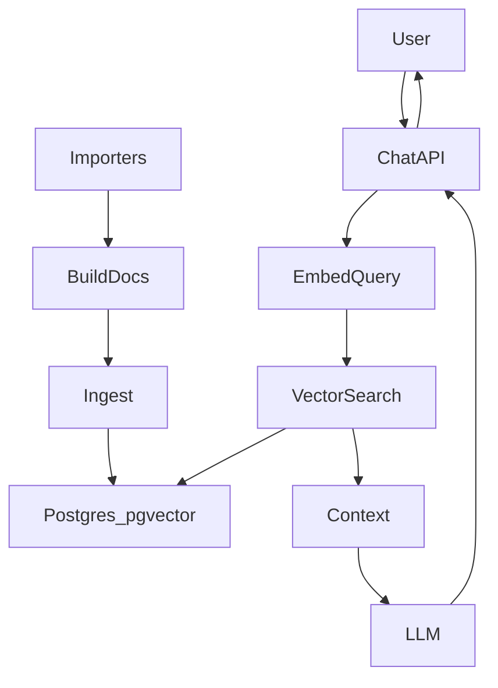

# Proposal RAG with LlamaIndex (Draft B)

## Requirements Prompt
- Enable semantic search and a future chatbot over proposals plus their stages (forum/snapshot/tally) using pgvector.
- Keep Neon (prod) and node-postgres (local) behavior consistent.
- Follow LlamaIndex conventions for ingestion and vector storage to reduce custom glue code.
- Build ingestion, retrieval API, and a minimal UI with citations.

## Clarifications
- Corpus: include full Snapshot body and forum content when available, in addition to proposal + stage summary.
- Ingestion: manual trigger only (no scheduled job in v1).
- Models: OpenAI embeddings + OpenAI LLM.
- Retrieval: top-K similarity with filters by stage/status.

## Goals
- Implement LlamaIndex-based RAG over proposals and stages with pgvector.
- Provide a Next.js API endpoint for natural language queries.
- Return answers with citations and proposal metadata.

## Non-Goals
- Automatic scheduled ingestion.
- Full evaluation harness or offline benchmarks.
- Streaming chat UI with multi-turn memory in v1.

## Architecture (high level)

## LlamaIndex Conventions
- Use the LlamaIndex Postgres/pgvector vector store so it creates and manages its own tables.
- Store proposal metadata in LlamaIndex metadata JSON for filtering.
- Create vector indexes (HNSW or IVFFLAT) on the LlamaIndex vector store tables.

## Metadata Schema (LlamaIndex JSON)
Required keys for each node:
- `proposal_id` (UUID)
- `stage` (`forum` | `snapshot` | `tally`)
- `status` (string)
- `url` (string)
- `source_id` (snapshot_id or forum original_id)
- `chunk_index` (number)

## Ingestion Pipeline (manual trigger)
1. Fetch proposal + stage rows.
2. Build a canonical document per proposal:
   - Title, author, category
   - Forum content + metadata
   - Snapshot body + status/voting window/options
   - Tally status + deadlines + options
3. Chunk documents (NodeParser) and attach metadata.
4. Embed chunks with OpenAI embeddings (`text-embedding-3-small`, 1536 dims).
5. Write nodes into LlamaIndex vector store tables.

### Idempotency
- Compute a `content_hash` per chunk.
- Use deterministic node IDs: `${proposal_id}:${stage}:${chunk_index}`.
- Upsert nodes by ID; skip if hash unchanged.

### Manual Trigger
- Admin-protected endpoint or CLI script (no cron).
- Log ingestion counts and errors.

## Retrieval + Chat API
- Route: `app/api/rag/route.ts` (POST).
- Input: `{ query: string, filters?: { stage?: string[], status?: string[] }, topK?: number }`
- Process:
  - Embed query using OpenAI embeddings.
  - Retrieve top-K with LlamaIndex vector store and metadata filters.
  - Synthesize response via OpenAI LLM with citations.
- Output: `{ answer, citations: [{ proposal_id, stage, url, snippet }] }`

## Security and Safety
- Treat retrieved text as untrusted; do not follow instructions within it.
- Add prompt guardrails to ignore injected instructions.
- Validate filters against an allowlist.

## Ops and Runtime Safeguards
- Enable pgvector: `CREATE EXTENSION IF NOT EXISTS vector;`
- Env vars: `OPENAI_API_KEY`, `OPENAI_EMBEDDING_MODEL`, `OPENAI_CHAT_MODEL`, `RAG_TOP_K`, `RAG_TIMEOUT_MS`.
- Timeouts and retries for LLM calls.
- Cap `topK` and context length to control cost.

## UI (minimal)
- Add a simple admin page that posts to `/api/rag`.
- Display answer and citations, linking to proposal/stage URLs.

## Test Plan
- Backfill a small subset and run sample queries.
- Verify filter behavior by stage/status.
- Confirm citations map to correct proposal IDs.

## References
- https://docs.llamaindex.ai
- https://neon.tech/docs/extensions/pgvector
- https://neon.tech/guides/vector-search
- https://neon.tech/guides/chatbot-astro-postgres-llamaindex
