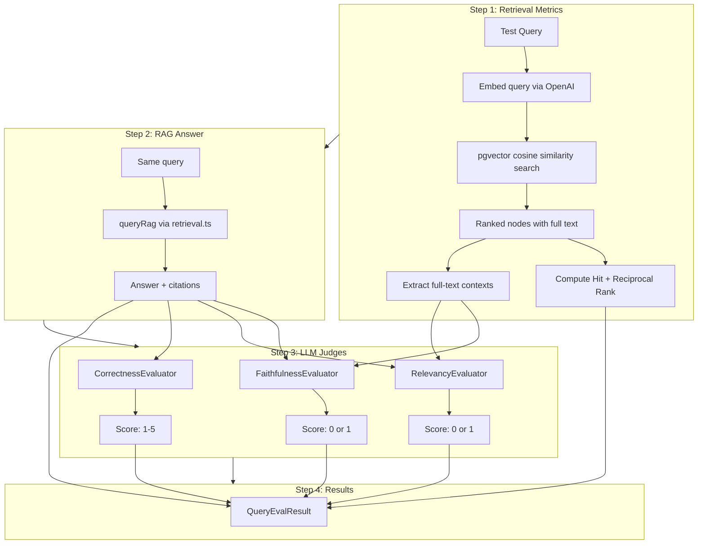

# RAG Evaluation Pipeline – Implementation Guide

**Status:** Implemented
**Date:** 2026-02-12
**Last Updated:** 2026-02-12

This document explains the AI-as-Judge evaluation pipeline that measures the quality of the Proposal RAG system. It covers the motivation, how LlamaIndex evaluators work internally, every design decision made during implementation, and how to run evaluations end-to-end.

## Background

The RAG pipeline (`services/rag/`) answers governance proposal questions using LlamaIndex + pgvector + OpenAI. But answering questions is only half the problem — we need to know **how good the answers are** and **which part is failing** when they're bad.

RAG has two distinct failure modes:

1. **Bad retrieval** — pgvector returned the wrong chunks. The LLM never saw the right evidence.
2. **Bad generation** — The right chunks were fetched, but the LLM hallucinated, went off-topic, or gave an incomplete answer.
   1. This might also be due to temprature which we setup during response

Without evaluation, you can't tell which is happening. You might tighten the system prompt to fix hallucination when the real problem is that retrieval is returning irrelevant chunks — or vice versa.

The evaluation pipeline was listed as a "known gap" in `docs/rag-team-overview.md` (line 846). This implementation closes that gap with a CLI tool (`yarn rag:eval`) that measures both retrieval and generation quality.

## Why These Choices

### LLM-as-Judge Pattern (Not Human Evaluation)

Human evaluation is the gold standard for quality but doesn't scale — you can't have someone read every answer after every code change. The **LLM-as-judge** pattern uses one LLM to grade another's output. It's the industry standard for RAG evaluation because:

- It's automated and repeatable (run after every change)
- It correlates well with human judgement for factual tasks
- It catches regressions before users do
- It produces structured scores you can track over time

The tradeoff is that the judge LLM can have its own biases (e.g., favoring verbose answers), but for our use case — factual governance data with clear right/wrong answers — this is a reasonable tradeoff.

### LlamaIndex's Built-in Evaluators (Zero New Dependencies)

The `llamaindex` package (v0.12.1) we already use ships three evaluators under `llamaindex/evaluation`. No new packages needed. The evaluators were documented in detail in `docs/rag-team-overview.md` (lines 466-847) before this implementation.

### CLI Tool (Not API Endpoint)

Evaluation is an offline diagnostic — you run it during development, not in production. A CLI tool (`yarn rag:eval`) follows the existing pattern of `yarn rag:ingest` and avoids adding unnecessary API surface. It also makes it easy to pipe output to files or CI systems.

### Sequential Execution (Not Parallel)

Queries are evaluated one at a time (`maxConcurrency: 1` default). This is deliberate:

- Avoids OpenAI rate limits during the many LLM-as-judge calls
- Makes console output readable (you see each query's results as it finishes)
- Cost and time are predictable
- This is an offline tool — speed is secondary to reliability

### Full-Text Contexts (Not Citation Snippets)

This is a critical design decision. The `RagCitation.snippet` from `queryRag()` is only a 200-character preview (see `retrieval.ts:121`). The LLM evaluators need the **full chunk text** to properly assess faithfulness and relevancy. So the evaluation pipeline calls the LlamaIndex retriever directly (separate from `queryRag()`) to get full-text context strings.

```
retrievalMetrics.ts → retriever.retrieve() → full text contexts
                                                     │
runner.ts ───────────────────────────────────────────▶ evaluators.ts
                                                     │
               queryRag() → 200-char snippets (NOT used for evaluation)
```

## How LlamaIndex Evaluators Work Internally

All three evaluators live in `llamaindex/evaluation` and share the same result shape:

```typescript
type EvaluationResult = {
  score: number; // 0-1 for faithfulness/relevancy, 1-5 for correctness
  passing: boolean; // did it pass the threshold?
  feedback: string; // LLM-generated explanation of the score
  response: string | null;
};
```

They all use `Settings.llm` — the same LLM configured for the RAG pipeline (gpt-5-mini in our case). The evaluator LLM is the **judge**, while the RAG pipeline's LLM is the **defendant**.

### 1. FaithfulnessEvaluator — "Is the answer grounded in the retrieved context?"

**Purpose:** Detects hallucination. If the RAG answer says something that isn't supported by any retrieved chunk, it's unfaithful.

**Score:** Binary — `1.0` (faithful) or `0.0` (hallucinated).

**Labels required:** None. Only needs the query, response, and context chunks.

**Internal mechanism (from `llamaindex/evaluation/dist/index.js`):**

```
Step 1: Wrap each context string into a LlamaIndex Document
Step 2: Build a SummaryIndex from those documents (in-memory, not pgvector)
Step 3: Create a QueryEngine from that index with custom evaluation prompts
Step 4: Send the RESPONSE TEXT (not the user query!) as the "query" to this engine
Step 5: For each context chunk, the LLM is asked:

    ┌─────────────────────────────────────────────────────────┐
    │ Please tell if a given piece of information             │
    │ is supported by the context.                            │
    │ You need to answer with either YES or NO.               │
    │ Answer YES if any of the context supports the           │
    │ information, even if most of the context is unrelated.  │
    │                                                         │
    │ Information: {response_text}                             │
    │ Context: {context_chunk}                                 │
    │ Answer:                                                  │
    └─────────────────────────────────────────────────────────┘

Step 6: If multiple chunks exist, a REFINE prompt iterates:

    ┌─────────────────────────────────────────────────────────┐
    │ We have provided an existing YES/NO answer: {previous}  │
    │ We have the opportunity to refine the existing answer    │
    │ (only if needed) with some more context below.          │
    │ {next_chunk}                                             │
    │ If the existing answer was already YES, still answer YES │
    └─────────────────────────────────────────────────────────┘

Step 7: Parse final answer: passing = rawResponse.includes("yes")
Step 8: score = passing ? 1.0 : 0.0
```

**Key insight:** The refine chain is **monotonically YES** — once any chunk supports the information, the answer stays YES regardless of later chunks. This means faithfulness measures "is the response supported by **any** of the retrieved context," not "is it supported by **all** of it."

**LLM calls:** N calls, where N = number of context chunks. With 15 chunks retrieved = 15 LLM calls per query.

### 2. RelevancyEvaluator — "Does the answer actually address the question?"

**Purpose:** Catches off-topic answers. The response might be faithful to the context but completely ignore what the user asked.

**Score:** Binary — `1.0` (relevant) or `0.0` (irrelevant).

**Labels required:** None. Only needs the query, response, and context chunks.

**Internal mechanism — nearly identical to Faithfulness, with one key difference:**

The "query" sent to the internal SummaryIndex engine is a **combination of both** the user query and the response:

```
Step 1-3: Same as Faithfulness (SummaryIndex from context chunks)
Step 4: The evaluation query is: "Question: {user_query}\nResponse: {response}"
Step 5: The prompt asks a DIFFERENT question:

    ┌─────────────────────────────────────────────────────────┐
    │ Your task is to evaluate if the response for the query  │
    │ is in line with the context information provided.       │
    │ You have two options to answer. Either YES/ NO.         │
    │ Answer - YES, if the response for the query is in line  │
    │ with context information otherwise NO.                  │
    │ Query and Response: {query_and_response}                │
    │ Context: {context_chunk}                                │
    │ Answer:                                                  │
    └─────────────────────────────────────────────────────────┘

Step 6-8: Same refine chain and YES/NO parsing as Faithfulness
```

**Why both Faithfulness AND Relevancy?**

They catch different failures:

| Scenario                                                      | Faithful? | Relevant? |
| ------------------------------------------------------------- | --------- | --------- |
| Answer is grounded in context and addresses the question      | YES       | YES       |
| Answer is grounded in context but ignores the actual question | YES       | NO        |
| Answer addresses the question but makes up facts              | NO        | YES       |
| Answer is completely wrong and off-topic                      | NO        | NO        |

Classic example: If you ask "What is the status of proposal X?" and the RAG returns a factually accurate summary of proposal Y (because retrieval fetched the wrong proposal), that's **faithful** (grounded in context) but **irrelevant** (doesn't answer what was asked).

**LLM calls:** N calls (same as Faithfulness — one per context chunk).

### 3. CorrectnessEvaluator — "Does the answer match a known-correct reference?"

**Purpose:** Compares the generated answer against a human-written reference answer. This is the most expensive to set up (you need to write reference answers) but the most precise measure of quality.

**Score:** Float, 1-5 scale. Pass threshold: 4.0 (configurable via `EVAL_CORRECTNESS_THRESHOLD`).

**Labels required:** Yes — a `referenceAnswer` string for each test query.

**Internal mechanism — much simpler than the other two:**

```
Step 1: Send a SINGLE llm.chat() call with two messages:

  System message (scoring rubric):
    ┌─────────────────────────────────────────────────────────┐
    │ You are an expert evaluation system...                  │
    │ Your score has to be between 1 and 5:                   │
    │ - 1: not relevant to the query                          │
    │ - 2-3: relevant but contains mistakes                   │
    │ - 4-5: relevant and fully correct                       │
    └─────────────────────────────────────────────────────────┘

  User message:
    ┌─────────────────────────────────────────────────────────┐
    │ ## User Query                                           │
    │ {query}                                                  │
    │                                                          │
    │ ## Reference Answer                                      │
    │ {referenceAnswer}                                        │
    │                                                          │
    │ ## Generated Answer                                      │
    │ {generatedAnswer}                                        │
    └─────────────────────────────────────────────────────────┘

Step 2: Parse response — first line = score (float), rest = reasoning
Step 3: passing = score >= scoreThreshold (default 4.0)
```

**LLM calls:** Exactly **1** LLM call per query. Much cheaper than the other two.

**When it's used:** Only for queries that have a `referenceAnswer` defined in `testQueries.ts`. In our test set, 3 out of 15 queries have reference answers (the "process" knowledge queries).

### Evaluator Comparison Summary

|                      | Faithfulness                | Relevancy                   | Correctness              |
| -------------------- | --------------------------- | --------------------------- | ------------------------ |
| **Needs labels?**    | No                          | No                          | Yes (reference answer)   |
| **Score type**       | Binary (0 or 1)             | Binary (0 or 1)             | Float (1-5)              |
| **LLM calls**        | N (per context chunk)       | N (per context chunk)       | 1                        |
| **Detects**          | Hallucination               | Off-topic answers           | Incomplete/wrong answers |
| **How it works**     | SummaryIndex + refine chain | SummaryIndex + refine chain | Single chat call         |
| **Cost (15 chunks)** | ~15 LLM calls               | ~15 LLM calls               | 1 LLM call               |

## Retrieval Metrics — Hit Rate & MRR

In addition to the three LLM-as-judge evaluators, we compute two standard information retrieval metrics that require **no LLM calls** (only embedding calls):

### Hit Rate

> "Did the correct proposal appear anywhere in the top-K results?"

```
Hit Rate = (queries where at least one expected proposal was retrieved) / (total queries)
```

A hit rate of 0.8 means 80% of queries successfully retrieved at least one relevant proposal. If hit rate is low, the problem is in **retrieval** (embedding quality, chunk content, top-K setting), not generation.

### MRR (Mean Reciprocal Rank)

> "How high was the first correct proposal ranked?"

```
For each query:
  If expected proposal is at rank 1 → reciprocal rank = 1/1 = 1.0
  If expected proposal is at rank 3 → reciprocal rank = 1/3 = 0.33
  If expected proposal is not found → reciprocal rank = 0

MRR = average of all reciprocal ranks
```

MRR tells you not just **whether** the right result was found, but **how quickly**. An MRR of 0.5 means the correct proposal is typically found around rank 2. Higher is better.

### How We Compute Them

The `evaluateRetrieval()` function in `retrievalMetrics.ts` uses the LlamaIndex retriever **directly** (not `queryRag()`):

```typescript
const index = await VectorStoreIndex.fromVectorStore(vectorStore);
const retriever = index.asRetriever({ similarityTopK: topK });
const nodes = await retriever.retrieve(testQuery.query);
```

This gives us the raw ranked list of nodes. We extract `proposal_id` from each node's metadata (deduplicating), then check if any expected proposal ID appears in the list and at what rank.

**Important:** This function also returns the **full-text context strings** that the LLM evaluators need. This dual purpose avoids a redundant retriever call.

## High-Level Architecture

```
                                     ┌─────────────────────┐
                                     │   cli-eval.ts        │
                                     │   (CLI entry point)  │
                                     └──────────┬──────────┘
                                                │
                                     ┌──────────▼──────────┐
                                     │   runner.ts          │
                                     │   (orchestrator)     │
                                     └──────────┬──────────┘
                                                │
                          ┌─────────────────────┼─────────────────────┐
                          │                     │                     │
               ┌──────────▼──────┐   ┌─────────▼────────┐   ┌───────▼────────┐
               │ retrievalMetrics │   │   evaluators.ts   │   │   queryRag()   │
               │   .ts            │   │  (LLM judges)     │   │  (RAG answer)  │
               └────────┬─────────┘   └────────┬──────────┘   └───────┬────────┘
                        │                      │                      │
                        │                      │                      │
               ┌────────▼─────────┐   ┌────────▼──────────┐   ┌──────▼────────┐
               │ LlamaIndex       │   │ LlamaIndex        │   │ LlamaIndex    │
               │ Retriever        │   │ Evaluators         │   │ QueryEngine   │
               │ (embed + search) │   │ (LLM-as-judge)     │   │ (embed+LLM)   │
               └──────────────────┘   └───────────────────┘   └───────────────┘
                        │                      │                      │
                        └──────────────────────┼──────────────────────┘
                                               │
                                     ┌─────────▼─────────┐
                                     │   report.ts        │
                                     │  (console + JSON)  │
                                     └───────────────────┘
```

## End-to-End Flow Per Query

For each test query, the runner executes these steps **sequentially**:



**Note on Step 2 vs Step 1:** The retriever is called separately from `queryRag()` because:

- `queryRag()` returns 200-char snippet citations — not enough for evaluators
- `evaluateRetrieval()` returns full-text contexts — what evaluators need
- The retriever call also produces the hit/MRR metrics
- `queryRag()` is still called to get the actual RAG answer (with LLM synthesis)

This means each query involves **two** retriever calls (one in `evaluateRetrieval`, one inside `queryRag`). This is deliberate — keeping them separate means evaluation doesn't depend on internal `queryRag` implementation details.

## File Structure

```
packages/nextjs/services/rag/
├── evaluation/
│   ├── index.ts            # Barrel exports
│   ├── types.ts            # 7 TypeScript types for the eval pipeline
│   ├── config.ts           # Thresholds, concurrency, timeout settings
│   ├── testQueries.ts      # 15 curated test queries across 5 categories
│   ├── evaluators.ts       # Singleton wrappers for 3 LlamaIndex evaluators
│   ├── retrievalMetrics.ts # Hit Rate & MRR using LlamaIndex retriever
│   ├── runner.ts           # Orchestrator: runs all evaluations sequentially
│   └── report.ts           # Console table output + JSON file export
├── cli-eval.ts             # CLI entry point (follows cli-ingest.ts pattern)
└── (existing files...)
```

### How Files Relate to Each Other

| File                  | Depends On                                             | Exports                                          |
| --------------------- | ------------------------------------------------------ | ------------------------------------------------ |
| `types.ts`            | Nothing                                                | All 7 type definitions                           |
| `config.ts`           | Nothing                                                | `EVAL_CONFIG` object                             |
| `testQueries.ts`      | `types.ts`                                             | `TEST_QUERIES` array                             |
| `evaluators.ts`       | `config.ts`, `types.ts`, `llamaindex/evaluation`       | 3 evaluate functions                             |
| `retrievalMetrics.ts` | `config.ts`, `types.ts`, `../config`, `../vectorStore` | `evaluateRetrieval`, `computeAggregateRetrieval` |
| `runner.ts`           | Everything above + `../retrieval`                      | `runEvaluation`                                  |
| `report.ts`           | `types.ts`                                             | `printReport`, `saveReport`                      |
| `index.ts`            | Everything                                             | Re-exports public API                            |
| `cli-eval.ts`         | `evaluation/index.ts`, `../index`                      | CLI entry point (no exports)                     |

## Type System

Seven types form the evaluation data model:

### `EvalTestQuery` — A test case

```typescript
type EvalTestQuery = {
  id: string; // e.g. "query-001"
  query: string; // The question to ask
  expectedProposalIds: string[]; // Which proposals should be retrieved
  referenceAnswer?: string; // For correctness evaluation (optional)
  tags?: string[]; // For filtering: "status", "factual", "cross-stage"
};
```

### `LLMEvalResult` — Normalized evaluator output

```typescript
type LLMEvalResult = {
  score: number; // 0-1 for faithfulness/relevancy, 1-5 for correctness
  passing: boolean; // Did it meet the threshold?
  feedback: string; // LLM-generated explanation
};
```

This is our normalized version of LlamaIndex's `EvaluationResult`. We strip extra fields to keep reports clean.

### `RetrievalResult` — Per-query retrieval metrics

```typescript
type RetrievalResult = {
  hit: boolean; // Was an expected proposal found?
  reciprocalRank: number; // 1/rank of first match (0 if not found)
  retrievedProposalIds: string[]; // What was actually retrieved
};
```

### `QueryEvalResult` — Everything about one query's evaluation

Combines the RAG answer, citations, all evaluator scores, retrieval metrics, and timing into a single object. This is the per-row data in the report.

### `EvalSummary` — Aggregate metrics

Averages and pass rates across all queries. This is the "at a glance" health check.

### `EvalReport` — The top-level output

Includes a timestamp, git commit hash, RAG config snapshot, options used, summary, and all per-query results. This is what gets saved to JSON for tracking over time.

### `EvalRunOptions` — CLI flags

```typescript
type EvalRunOptions = {
  retrievalOnly: boolean; // --retrieval-only
  skipCorrectness: boolean; // --skip-correctness
  outputPath?: string; // --output report.json
  filterTags?: string[]; // --tags status,factual
  filterIds?: string[]; // --ids query-001
  topK?: number; // --top-k 10
};
```

## Configuration

From `evaluation/config.ts`:

| Setting                | Default | Env Var                      | Purpose                                  |
| ---------------------- | ------- | ---------------------------- | ---------------------------------------- |
| `correctnessThreshold` | 4.0     | `EVAL_CORRECTNESS_THRESHOLD` | Minimum score (1-5) to pass correctness  |
| `maxConcurrency`       | 1       | `EVAL_CONCURRENCY`           | Queries evaluated in parallel (keep low) |
| `retrievalTopK`        | 15      | `EVAL_RETRIEVAL_TOP_K`       | Top-K for retrieval evaluation           |
| `queryTimeoutMs`       | 60000   | `EVAL_QUERY_TIMEOUT_MS`      | Timeout per query (60s default)          |

The config follows the same pattern as `rag/config.ts` — a const object with environment variable overrides.

## Test Query Set

`testQueries.ts` ships with 15 curated queries across 5 categories:

| Category                                   | Count | Query IDs        | What It Tests                                                  |
| ------------------------------------------ | ----- | ---------------- | -------------------------------------------------------------- |
| Status lookups                             | 3     | query-001 to 003 | "What is the status of X?" — tests basic metadata retrieval    |
| Author attribution                         | 2     | query-004 to 005 | "Who proposed X?" — tests author field in metadata             |
| Forum discussion                           | 3     | query-006 to 008 | "What concerns were raised?" — tests forum content retrieval   |
| Cross-stage                                | 2     | query-009 to 010 | "Compare forum vs on-chain vote" — tests multi-stage retrieval |
| Specific details                           | 2     | query-011 to 012 | "What was the budget?" — tests factual precision               |
| Process knowledge (with reference answers) | 3     | query-013 to 015 | Tests correctness against known answers                        |

### Populating Expected Proposal IDs

The `expectedProposalIds` arrays ship empty. To populate them:

1. Run `yarn rag:eval --retrieval-only` to see which proposals are being retrieved for each query
2. Review the retrieved IDs in the report output
3. Update the arrays with the correct expected IDs
4. Future runs will then compute meaningful Hit Rate and MRR

This is a one-time setup step that depends on your database contents.

## The Runner (Orchestration Logic)

`runner.ts` is the core orchestrator. Here's the control flow:

```
runEvaluation(options)
  │
  ├── Filter test queries by --tags or --ids
  │
  ├── For each query (sequentially):
  │     │
  │     ├── evaluateRetrieval() ──▶ retrieval metrics + full-text contexts
  │     │
  │     ├── [if not --retrieval-only]:
  │     │     ├── queryRag() ──▶ RAG answer + citations
  │     │     ├── evaluateFaithfulness(query, answer, contexts) ──▶ score
  │     │     ├── evaluateRelevancy(query, answer, contexts) ──▶ score
  │     │     └── [if referenceAnswer && not --skip-correctness]:
  │     │           └── evaluateCorrectness(query, answer, reference) ──▶ score
  │     │
  │     └── Catch errors → log and continue to next query
  │
  ├── computeSummary() ──▶ aggregate metrics
  │
  ├── Capture git commit hash (optional)
  │
  └── Return EvalReport
```

**Error handling:** If a single query fails (API timeout, LLM error, etc.), the error is logged and the pipeline continues to the next query. The failed query appears in the report with an error message. This is important because a single flaky API call shouldn't abort the entire evaluation run.

**Timeout:** Each `queryRag()` call has a 60-second timeout (configurable via `EVAL_QUERY_TIMEOUT_MS`). This is separate from the RAG pipeline's own 30-second timeout — the evaluation timeout wraps the entire `queryRag()` call.

## Report Output

The report has two modes:

### Console Output

Automatically printed after every run. Structure:

```
============================================================
  RAG Evaluation Report
============================================================

  Timestamp:    2026-02-12T10:30:00.000Z
  Git commit:   11b3cff
  Chat model:   gpt-5-mini
  Embed model:  text-embedding-3-large
  Top-K:        15

------------------------------------------------------------
  SUMMARY
------------------------------------------------------------
  Queries:       14/15 successful
  Total time:    183.2s

  Retrieval:
    Hit Rate:    73.3%
    MRR:         0.542

  LLM Judges:
    Faithfulness:  avg=0.86  pass=85.7%
    Relevancy:     avg=0.93  pass=92.9%
    Correctness:   avg=4.20/5  pass=66.7%

  Est. cost:     $0.310

------------------------------------------------------------
  PER-QUERY DETAILS
------------------------------------------------------------

  [FAIL] query-006: What concerns were raised in the forum discuss...
         Duration: 12340ms | Status: FAIL
         Hit: YES | RR: 0.500 | Retrieved: [abc-123, def-456]
         Faithfulness: FAIL (0)
         Relevancy:    PASS (1)
         Answer: The Gaming Catalyst Program received mixed feedback...

  [PASS] query-001: What is the current status of the ArbitrumDAO...
         Duration: 8210ms | Status: PASS
         Hit: YES | RR: 1.000 | Retrieved: [ghi-789]
         Faithfulness: PASS (1)
         Relevancy:    PASS (1)
         Answer: The ArbitrumDAO Constitution proposal has been executed...
```

**Failures are sorted first** — so you immediately see what needs attention.

### JSON Report

Saved via `--output report.json`. Contains the full `EvalReport` object with all per-query data. Useful for:

- Tracking metrics over time (commit-to-commit comparison)
- Programmatic analysis (e.g., charting faithfulness trends)
- CI integration (fail the build if metrics drop below thresholds)

## Singleton Evaluator Pattern

`evaluators.ts` wraps the three LlamaIndex evaluators with lazy singletons:

```typescript
let faithfulnessEvaluator: FaithfulnessEvaluator | null = null;

function getFaithfulnessEvaluator(): FaithfulnessEvaluator {
  if (!faithfulnessEvaluator) {
    faithfulnessEvaluator = new FaithfulnessEvaluator();
  }
  return faithfulnessEvaluator;
}
```

This avoids re-instantiating evaluators (and their internal prompt templates) across the 15 queries. It matches the existing `vectorStoreInstance` singleton pattern in `vectorStore.ts`.

The wrapper functions also normalize the LlamaIndex `EvaluationResult` down to our simpler `LLMEvalResult` type — stripping internal fields like `meta` and `scoreSecondary` that we don't need.

## CLI Usage

```bash
# Full evaluation (all 3 evaluators + retrieval metrics)
yarn rag:eval

# Only Hit Rate & MRR (zero LLM-judge cost, only embedding calls)
yarn rag:eval --retrieval-only

# Skip CorrectnessEvaluator (saves a bit on LLM calls)
yarn rag:eval --skip-correctness

# Save JSON report for tracking over time
yarn rag:eval --output report.json

# Run only queries tagged "status" or "factual"
yarn rag:eval --tags status,factual

# Run a single specific query
yarn rag:eval --ids query-001

# Override retrieval top-K (useful for testing recall at different K values)
yarn rag:eval --top-k 10
```

The CLI follows the exact same pattern as `cli-ingest.ts`:

- Loads env from `.env.development` then `.env.local` (override)
- Cleans up `closeVectorStore()` + `closeDb()` in `finally` block
- Force exits to clean lingering PGVectorStore connections

## Cost Estimate

For the 15-query test set:

| Mode             | Embedding Calls                 | LLM Judge Calls                                                 | Est. Cost   | Est. Time |
| ---------------- | ------------------------------- | --------------------------------------------------------------- | ----------- | --------- |
| Full evaluation  | 30 (15 retrieval + 15 queryRag) | ~175 (15 faithful + 15 relevant + 3 correct + ~142 chunk-level) | ~$0.05-0.15 | 3-5 min   |
| Skip correctness | 30                              | ~172                                                            | ~$0.05-0.14 | 3-5 min   |
| Retrieval only   | 15 (embed only)                 | 0                                                               | ~$0.01      | 30s       |

**Why ~175 LLM calls in full mode?** Faithfulness and Relevancy each make one LLM call per **context chunk** (not per query). With top-K=15, each query could generate up to 15 faithfulness calls + 15 relevancy calls. Across 15 queries that's up to 450 calls, but in practice many chunks are short and the refine chain short-circuits.

## Interpreting Results — Diagnosis Guide

| Symptom                           | Likely Cause                             | Fix                                                                                       |
| --------------------------------- | ---------------------------------------- | ----------------------------------------------------------------------------------------- |
| Low Hit Rate (< 50%)              | Retrieval misses relevant proposals      | Increase `topK`, improve canonical text quality, check if proposals are ingested          |
| High Hit Rate but low MRR         | Right proposals found but ranked low     | Tune embedding model, add metadata to boost ranking, consider reranking                   |
| Low Faithfulness                  | LLM hallucinating despite good context   | Tighten system prompt, reduce `topK` to reduce noise in context                           |
| Low Relevancy                     | Answers drift off-topic                  | Check if retrieved chunks are too generic, add metadata filters                           |
| High Faithfulness + Low Relevancy | Answer is factual but for wrong question | Retrieval is fetching wrong proposals; improve query-document matching                    |
| Low Correctness                   | Answers partially right                  | Check chunk boundaries (overlap tuning), ensure canonical text has complete information   |
| All scores low                    | Corpus quality issue                     | Review ingestion output, check content cleaning pipeline, validate embeddings are working |

## Implementation Decisions & Trade-offs

### Why Separate `evaluateRetrieval()` from `queryRag()`?

**Considered:** Extracting contexts from `queryRag()`'s internal response source nodes.

**Chose:** Calling the retriever directly in `evaluateRetrieval()`.

**Rationale:**

- `queryRag()` returns 200-char snippets in citations, not full chunk text
- Evaluators need full text to properly assess faithfulness/relevancy
- Keeping them separate means evaluation doesn't depend on `queryRag()` internals
- Trade-off: two retriever calls per query (slightly more cost), but cleaner architecture

### Why Sequential Execution?

**Considered:** Running queries in parallel for speed.

**Chose:** Sequential with `maxConcurrency: 1`.

**Rationale:**

- OpenAI rate limits can cause cascading failures with parallel LLM calls
- Console output is readable when results come in order
- This is an offline diagnostic tool, not user-facing
- Configurable via `EVAL_CONCURRENCY` env var if users want to experiment

### Why configureSettings() Is Duplicated?

**Considered:** Extracting a shared `configureSettings()` into `config.ts`.

**Chose:** Duplicate in `retrievalMetrics.ts` (matching the existing pattern).

**Rationale:**

- Both `retrieval.ts` and `ingestion.ts` already have their own copies
- Adding a shared version would be a refactor of existing code
- The function is 8 lines — duplication cost is minimal
- Follows existing codebase convention

### Why Empty `expectedProposalIds`?

**Considered:** Auto-populating expected IDs by querying the database.

**Chose:** Ship empty with clear instructions to populate manually.

**Rationale:**

- Expected IDs depend on what's actually in your database (which varies by environment)
- Auto-populating would make "expected" mean "whatever we got" (circular)
- Manual population forces you to think about what _should_ be retrieved
- The `--retrieval-only` mode is specifically designed to help with this population step

## Related Documentation

- **RAG overview:** `docs/rag-current-setup.md` — how the RAG pipeline works
- **Forum enrichment:** `docs/forum-content-enrichment.md` — how forum content is ingested
- **Team overview:** `docs/rag-team-overview.md` (lines 466-847) — evaluator theory and usage examples
- **RAG types:** `packages/nextjs/services/rag/types.ts` — core RAG type definitions
- **Eval types:** `packages/nextjs/services/rag/evaluation/types.ts` — evaluation-specific types

## Quickstart

```bash
# 1. Make sure your database has ingested proposals
yarn rag:ingest

# 2. Run retrieval-only evaluation (fast, cheap) to see what's being retrieved
yarn rag:eval --retrieval-only

# 3. Update expectedProposalIds in testQueries.ts based on results

# 4. Run full evaluation
yarn rag:eval

# 5. Save a baseline report
yarn rag:eval --output baseline-report.json

# 6. After making changes (new prompts, different topK, etc.), re-evaluate
yarn rag:eval --output after-change-report.json

# 7. Compare the two JSON reports to see what improved/regressed
```

## Known Gaps / Future Improvements

- **Concurrency:** Currently sequential; could add parallel evaluation with rate limiting for faster runs
- **Streaming progress:** No progress bar; just sequential log lines
- **CI integration:** No threshold-based pass/fail exit codes yet (always exits 0 on success)
- **Auto-population:** Expected proposal IDs must be manually populated after first run
- **Reference answers:** Only 3 of 15 queries have reference answers for correctness
- **Custom evaluator prompts:** Currently using LlamaIndex defaults; could tune prompts for governance domain
- **Historical tracking:** JSON reports can be saved but there's no built-in diff/comparison tool
- **Reranking evaluation:** No metrics for evaluating reranking quality (not implemented yet in RAG pipeline)
