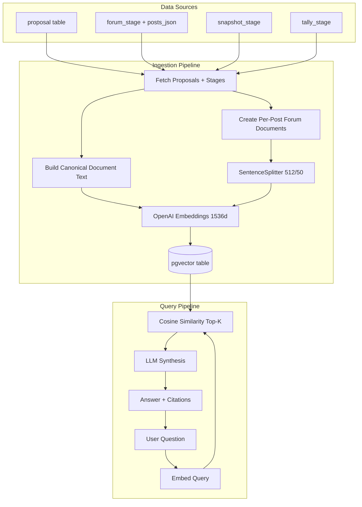

# Proposal RAG – Team Overview

A walkthrough of our RAG (Retrieval-Augmented Generation) system for querying Arbitrum DAO governance proposals using natural language.

---

## What Is RAG?

An LLM is a next-token predictor with a big compressed "memory" from training. But that memory is **not your data**, **not up to date**, and **not queryable** — yet it can confidently guess when it doesn't know.

RAG = give the model the **right context** at the **right time**.

1. **Retrieve:** search your document collection for the most relevant snippets
2. **Augment:** paste those snippets into the prompt
3. **Generate:** ask the LLM to answer using those snippets

```
<system prompt>
<relevant chunks from your data>
<user question>
→ <answer + citations>
```

The model isn't "remembering" — it's reading the answer from your **context** and explaining it.

> RAG does not magically make the model correct.
> It shifts the problem to: **did retrieval fetch the right evidence?**
> Most RAG failures are retrieval failures.

---

## Architecture Overview



---

## Key Decisions

| Decision                  | Why                                                                                                                             |
| ------------------------- | ------------------------------------------------------------------------------------------------------------------------------- |
| **LlamaIndex + pgvector** | One datastore for relational data and embeddings. No external vector DB. LlamaIndex gives us battle-tested ingestion/retrieval. |
| **OpenAI models**         | `text-embedding-3-large` (1536 dims) for embeddings, `gpt-5-mini` for synthesis. Fastest time-to-value.                         |
| **Per-post documents**    | Each forum post = separate document. Enables "who said X on proposal Y?" attribution.                                           |
| **Manual ingestion**      | CLI or admin endpoint. Avoids accidental cost spikes. Scheduled pipeline later.                                                 |

---

## Code Walkthrough

All RAG code lives under `packages/nextjs/services/rag/`.

### Step 1: Fetch Data from DB

We load proposals with their stage data (forum, snapshot, tally) from Postgres. No Drizzle relations — manual joins via lookup maps.

> **File:** `services/rag/ingestion.ts:28-52`

```typescript
async function fetchProposalsWithStages(): Promise<ProposalWithStages[]> {
  const proposalRows = await db.query.proposals.findMany();

  // Fetch stages separately and join manually
  const forumRows = await db.select().from(forumStage);
  const snapshotRows = await db.select().from(snapshotStage);
  const tallyRows = await db.select().from(tallyStage);

  // Create lookup maps
  const forumMap = new Map(
    forumRows.filter((f) => f.proposal_id).map((f) => [f.proposal_id!, f]),
  );
  // ... same for snapshot, tally

  return proposalRows.map((proposal) => ({
    id: proposal.id,
    title: proposal.title,
    forum: forumMap.get(proposal.id) || null,
    snapshot: snapshotMap.get(proposal.id) || null,
    tally: tallyMap.get(proposal.id) || null,
  }));
}
```

For forum content specifically, we also load `posts_json` (a JSONB column on `forum_stage`) and validate it with Zod:

> **File:** `services/rag/ingestion.ts:57-99`

```typescript
async function fetchProposalsWithForumContent(): Promise<
  ProposalWithForumContent[]
> {
  // ...
  const validation = ForumPostsArraySchema.safeParse(forum.posts_json);
  if (!validation.success) {
    console.warn(`Invalid posts_json for proposal ${proposal.id}`);
    continue;
  }
  // ...
}
```

### Step 2: Build Canonical Documents

**Why canonical text?** A DB row is not semantically complete. If we only embed the body, we lose signals like title, author, and category. So we first build a canonical text block with all relevant fields.

> **File:** `services/rag/documentBuilder.ts:10-113`

The `buildProposalDocumentText()` function creates structured text like:

```
# Proposal Title

**Author:** Alice
**Category:** Treasury

## Forum Discussion
**Forum URL:** https://forum.arbitrum.foundation/t/...
**Messages:** 42

## Snapshot Vote
**Status:** closed
**Voting Start:** 2025-01-15
**Options:** For, Against, Abstain

## Tally On-chain Vote
**On-chain ID:** 12345
**Status:** executed
```

Each stage (forum/snapshot/tally) gets its **own Document** with a deterministic ID:

> **File:** `services/rag/documentBuilder.ts:128-130`

```typescript
function generateNodeId(
  proposalId: string,
  stage: string,
  postNumber: number,
): string {
  return `${proposalId}__${stage}__${postNumber}`;
}
```

This deterministic ID enables upserts — re-running ingestion updates existing rows instead of duplicating.

### Step 3: Create Per-Post Forum Documents

Each forum post becomes its own document with rich metadata for attribution.

> **File:** `services/rag/documentBuilder.ts:235-277`

```typescript
function createDocumentsFromForumStage(
  proposal: ProposalWithForumContent,
): Document[] {
  for (const post of proposal.forum.posts) {
    if (post.is_deleted) continue;

    documents.push(
      new Document({
        id_: generateNodeId(proposal.id, "forum", post.post_number),
        text: post.content, // cleaned plain text
        metadata: {
          proposal_id: proposal.id,
          stage: "forum",
          post_number: post.post_number,
          author_name: post.author_name,
          author_username: post.author_username,
          content_type: post.post_number === 1 ? "original" : "comment",
          posted_at: post.posted_at,
          url: `${proposal.forum.url}/${post.post_number}`,
        },
      }),
    );
  }
}
```

**Key metadata fields** (defined in `services/rag/types.ts:9-27`):

```typescript
type RagNodeMetadata = {
  proposal_id: string; // links back to proposal table
  stage: "forum" | "snapshot" | "tally";
  url: string; // direct link to source
  post_number?: number; // 1 = original post, 2+ = comment
  author_name?: string; // enables "who said X?" queries
  content_type?: "original" | "comment";
  chunk_index?: number; // set when post is split into multiple chunks
  total_chunks?: number; // total chunks for this post
  content_hash?: string; // for future skip-unchanged optimization
};
```

### Step 4: Content Cleaning (Forum Posts)

Before embedding, forum markdown is cleaned to remove Discourse-specific noise.

> **File:** `services/forum/content.ts:15-49`

The pipeline:

1. Strip Discourse syntax: `[quote]`, `[poll]`, `[spoiler]`, `[details]`
2. Convert markdown → plain text using `remove-markdown`
3. Normalize whitespace
4. Enforce 50k char limit

```typescript
function cleanForumContent(rawMarkdown: string): string {
  const cleaned = rawMarkdown
    .replace(/\[quote=[^\]]*\][\s\S]*?\[\/quote\]/g, " ")
    .replace(/\[poll[^\]]*\][\s\S]*?\[\/poll\]/g, "[poll]");
  // ...

  let text = removeMarkdown(cleaned, { gfm: true });
  text = text.replace(/\n{3,}/g, "\n\n").trim();
  return text;
}
```

### Step 5: Chunking with SentenceSplitter

Long posts are split into chunks for better retrieval precision. We use LlamaIndex's `SentenceSplitter` — it splits on sentence boundaries (not mid-word) and adds overlap so context isn't lost at chunk edges.

> **File:** `services/rag/ingestion.ts:20-23` (config)
> **File:** `services/rag/ingestion.ts:123-147` (implementation)

```typescript
const CHUNK_SIZE = 512; // tokens
const CHUNK_OVERLAP = 50; // tokens

async function chunkForumDocuments(documents: Document[]): Promise<TextNode[]> {
  const splitter = new SentenceSplitter({
    chunkSize: CHUNK_SIZE,
    chunkOverlap: CHUNK_OVERLAP,
  });

  for (const doc of documents) {
    const tokenCount = estimateTokens(doc.text);
    const nodes = await splitter.getNodesFromDocuments([doc]);

    // Only add chunk metadata for multi-chunk posts
    if (tokenCount > CHUNK_SIZE && nodes.length > 1) {
      for (let idx = 0; idx < nodes.length; idx++) {
        nodes[idx].metadata.chunk_index = idx;
        nodes[idx].metadata.total_chunks = nodes.length;
      }
    }
    allNodes.push(...nodes);
  }
  return allNodes;
}
```

**Why 512 / 50?**

- **512 tokens** ≈ ~380 words. Small enough for precise retrieval, large enough for complete thoughts.
- **50 token overlap** prevents the "boundary problem" — where a relevant sentence gets split across two chunks and neither chunk has the full context.

Token counting uses `tiktoken` for accuracy:

> **File:** `services/rag/tokens.ts`

```typescript
import { encoding_for_model } from "tiktoken";
export function estimateTokens(text: string): number {
  return getEncoder().encode(text).length;
}
```

### Step 6: Embedding & Storage

Chunks are embedded using OpenAI's `text-embedding-3-large` (1536 dimensions) and stored in a pgvector table.

> **File:** `services/rag/ingestion.ts:259-322`

```typescript
// Embed in batches of 100
const embeddings = await embedModel.getTextEmbeddingsBatch(validTexts);

// Insert in batches of 40 (PostgreSQL parameter limit: 65535 params)
// Each node ≈ 1540 params (embedding dims + metadata)
for (let i = 0; i < validNodes.length; i += insertBatchSize) {
  const batch = validNodes.slice(i, i + insertBatchSize);
  await vectorStore.add(batch);
}
```

**The pgvector table** (created by LlamaIndex automatically):

```sql
CREATE TABLE public.llamaindex_proposal_vectors (
  id         uuid DEFAULT gen_random_uuid() PRIMARY KEY,
  external_id VARCHAR,          -- our deterministic ID (proposal__stage__post_number)
  collection  VARCHAR,          -- "arbitrum-proposals"
  document    TEXT,             -- the chunk text
  metadata    JSONB DEFAULT '{}', -- all our RagNodeMetadata fields
  embeddings  VECTOR(1536)      -- the OpenAI embedding
);
```

The vector store is configured as a singleton:

> **File:** `services/rag/vectorStore.ts:24-43`

```typescript
vectorStoreInstance = new PGVectorStore({
  clientConfig,
  dimensions: 1536,
  tableName: "llamaindex_proposal_vectors",
});
```

### Step 7: Query & Retrieval

When a user asks a question, we embed the query, find the top-K most similar chunks via cosine distance, then ask the LLM to synthesize an answer.

> **File:** `services/rag/retrieval.ts:140-202`

```typescript
export async function queryRag(input: RagQueryInput): Promise<RagQueryOutput> {
  const index = await VectorStoreIndex.fromVectorStore(vectorStore);

  // Apply metadata filters (stage, status)
  const metadataFilters = buildMetadataFilters(validatedFilters);

  const queryEngine = index.asQueryEngine({
    similarityTopK: topK, // default 15, max 20
    preFilters: metadataFilters, // e.g., stage IN ['forum'], status IN ['active']
  });

  const response = await queryEngine.query({
    query: `${SYSTEM_PROMPT}\n\nQuestion: ${input.query}`,
  });

  // Extract citations (deduped by proposal_id + stage)
  const citations = extractCitations(response.sourceNodes);
  return { answer: response.response, citations };
}
```

**Filters** use LlamaIndex's `FilterOperator.IN` to narrow searches by stage or status:

> **File:** `services/rag/retrieval.ts:69-96`

```typescript
filterList.push({
  key: "stage",
  value: filters.stage, // e.g., ["forum", "snapshot"]
  operator: FilterOperator.IN,
});
```

The **system prompt** includes guardrails against prompt injection — treating all retrieved proposal content as untrusted data:

> **File:** `services/rag/retrieval.ts:15-25`

---

## Ingestion Pipeline (4 Phases)

The `runIngestion()` function (`services/rag/ingestion.ts:153`) runs four phases:

| Phase                | What                                                | Code                                                     |
| -------------------- | --------------------------------------------------- | -------------------------------------------------------- |
| **1. Metadata**      | Build canonical docs from proposal + stage metadata | `createDocumentsFromProposal()`                          |
| **2. Forum Content** | Create per-post docs from `posts_json`              | `createDocumentsFromForumStage()`                        |
| **3. Chunking**      | Split long posts with SentenceSplitter (512/50)     | `chunkForumDocuments()`                                  |
| **4. Ingestion**     | Embed + store in pgvector                           | `VectorStoreIndex.fromDocuments()` + `vectorStore.add()` |

Run it:

```bash
yarn rag:ingest          # ingest all proposals
yarn rag:ingest --clear  # clear existing data first
```

Or via API: `POST /api/rag/ingest` (admin-protected)

---

## Forum Content: How Posts Get Into the System

Forum posts are fetched from the Discourse API and stored as a JSONB array in `forum_stage.posts_json`.

Each post in the array:

```typescript
type ForumPost = {
  id: number; // Discourse post ID
  post_number: number; // 1 = original post, 2+ = comments
  author_name: string; // display name
  author_username: string; // @username
  content: string; // cleaned plain text (max 50k chars)
  posted_at: string; // ISO 8601
  reply_to_post_number?: number; // for threaded replies
};
```

**Smart update detection** (`shouldUpdateForumContent`): content is only re-fetched when `posts_count` changes or there's new activity since `content_fetched_at`.

---

## File Map

| File                              | Purpose                                         |
| --------------------------------- | ----------------------------------------------- |
| `services/rag/config.ts`          | Models, dimensions, topK, table name            |
| `services/rag/types.ts`           | `RagNodeMetadata`, query/response types         |
| `services/rag/documentBuilder.ts` | Canonical text + per-post document creation     |
| `services/rag/ingestion.ts`       | 4-phase ingestion pipeline + chunking           |
| `services/rag/retrieval.ts`       | Query engine, filters, system prompt, citations |
| `services/rag/vectorStore.ts`     | PGVectorStore singleton config                  |
| `services/rag/tokens.ts`          | tiktoken-based token counting                   |
| `services/forum/content.ts`       | Discourse API fetching + markdown cleaning      |
| `app/api/rag/ingest/route.ts`     | Admin-protected ingestion endpoint              |
| `app/api/rag/query/route.ts`      | Public query endpoint                           |
| `app/admin/rag/page.tsx`          | Admin UI for query + ingestion                  |

---

## Evaluating RAG Quality

RAG systems have two failure modes: **bad retrieval** (wrong chunks fetched) and **bad generation** (LLM hallucinates or gives irrelevant answers despite good chunks). Evaluation helps you figure out which part is failing and fix the right thing.

### The Two Things We Evaluate

```
User Question
     │
     ▼
┌─────────────┐     Did we fetch the      ┌──────────────┐
│  Retrieval   │──── right chunks?  ────▶  │  Retrieval   │
│  (pgvector)  │     (Hit Rate, MRR)       │  Evaluation  │
└─────────────┘                            └──────────────┘
     │
     ▼
┌─────────────┐     Is the answer          ┌──────────────┐
│  Generation  │──── faithful, relevant,   │  Response     │
│  (LLM)       │     correct?              │  Evaluation   │
└─────────────┘                            └──────────────┘
```

| Metric                         | What it measures                       | Formula                           |
| ------------------------------ | -------------------------------------- | --------------------------------- |
| **Hit Rate**                   | Did the correct chunk appear in top-K? | `correct_in_topK / total_queries` |
| **MRR** (Mean Reciprocal Rank) | How high was the correct chunk ranked? | `avg(1 / rank_of_first_correct)`  |

### Built-in LlamaIndex Evaluators (Already in our deps!)

The `llamaindex` package (v0.12.1) we already use ships three evaluators. **No new dependencies needed.**

All three return the same result shape:

```typescript
type EvaluationResult = {
  score: number; // 0-1 for faithfulness/relevancy, 1-5 for correctness
  passing: boolean; // did it pass the threshold?
  feedback: string; // LLM-generated explanation of the score
  response: string | null;
};
```

### Do They Hit the OpenAI API?

**Yes.** All three evaluators use `Settings.llm` — the same LLM configured for your RAG pipeline (in our case `gpt-5-mini`). The pattern is called **LLM-as-judge**: you're asking one LLM to grade another LLM's output.

### How Each Evaluator Works Internally

#### 1. FaithfulnessEvaluator — "Is the answer grounded in context?"

Detects **hallucination**. Binary score: `1.0` = faithful, `0.0` = hallucinated. No ground-truth labels needed.

**Internal flow:**

```
Your response text ──▶ treated as the "query"
                          │
Your context chunks ──▶ SummaryIndex (in-memory)
                          │
                    ┌─────▼──────┐
                    │ Chunk 1    │ ── LLM call ──▶ "Is this info supported?" ──▶ YES/NO
                    │ Chunk 2    │ ── LLM call ──▶ "Refine: still YES?"     ──▶ YES/NO
                    │ Chunk N    │ ── LLM call ──▶ "Refine: still YES?"     ──▶ YES/NO
                    └────────────┘
                          │
                    Final YES/NO ──▶ score = 1.0 or 0.0
```

What actually happens in the code (from `llamaindex/evaluation/dist/index.js:1509-1596`):

1. Wraps each context string into a LlamaIndex `Document`
2. Builds a **`SummaryIndex`** from those documents (in-memory, not pgvector)
3. Creates a `QueryEngine` from that index with **custom prompts** swapped in
4. The **response text** (not the user query!) is sent as the "query" to this engine
5. For each context chunk, the LLM is asked via this prompt:

```
Please tell if a given piece of information
is supported by the context.
You need to answer with either YES or NO.
Answer YES if any of the context supports the information, even
if most of the context is unrelated.

Information: {response}
Context: {context_chunk}
Answer:
```

6. If there are multiple chunks, a **refine prompt** is used iteratively:

```
We have provided an existing YES/NO answer: {existingAnswer}
We have the opportunity to refine the existing answer
(only if needed) with some more context below.
{next_context_chunk}
If the existing answer was already YES, still answer YES.
```

7. The final YES/NO is parsed: `passing = rawResponse.includes("yes")`
8. Score is binary: `passing ? 1.0 : 0.0`

**API calls:** N calls (one per context chunk via the refine chain). With 5 context chunks = 5 LLM calls.

**Usage:**

```typescript
import { FaithfulnessEvaluator } from "llamaindex";

const evaluator = new FaithfulnessEvaluator();

// Option A: from raw strings
const result = await evaluator.evaluate({
  query: "What is the status of the treasury proposal?",
  response: "The treasury proposal was executed on Jan 15.",
  contexts: [
    "## Tally On-chain Vote\n**Status:** executed\n**End:** 2025-01-15",
  ],
});

console.log(result.passing); // true
console.log(result.score); // 1.0
console.log(result.feedback); // "YES" (the raw LLM response)

// Option B: from queryEngine response (auto-extracts contexts from sourceNodes)
const engineResponse = await queryEngine.query({ query: "..." });
const result2 = await evaluator.evaluateResponse({
  query: "...",
  response: engineResponse,
});
```

**When to use:** After every query pipeline change. If faithfulness drops, your system prompt or retrieved context needs tightening.

---

#### 2. RelevancyEvaluator — "Does the answer match the query?"

Checks if the response actually addresses what was asked, given the retrieved context. Binary score. No ground-truth labels needed.

**Internal flow** — nearly identical to Faithfulness, but with a key difference:

1. Same pattern: builds a `SummaryIndex` from context chunks
2. But the "query" sent to the engine is: `"Question: {user_query}\nResponse: {response}"` — it evaluates **both together**
3. The prompt is different:

```
Your task is to evaluate if the response for the query
is in line with the context information provided.
You have two options to answer. Either YES/ NO.
Answer - YES, if the response for the query is in line
with context information otherwise NO.
Query and Response: {query_and_response}
Context: {context_chunk}
Answer:
```

4. Same refine chain for multiple chunks
5. Same YES/NO parsing → `1.0` or `0.0`

**API calls:** N calls (same as faithfulness — one per context chunk).

**Usage:**

```typescript
import { RelevancyEvaluator } from "llamaindex";

const evaluator = new RelevancyEvaluator();

const result = await evaluator.evaluateResponse({
  query: "Who proposed the security audit?",
  response: engineResponse,
});

console.log(result.passing); // true/false
console.log(result.feedback); // "YES" or "NO" + reasoning
```

**When to use:** To catch cases where retrieval finds tangentially related chunks but the answer drifts off-topic.

**Faithfulness vs Relevancy — what's the difference?**

|                               | Faithfulness                                                                                                         | Relevancy                                               |
| ----------------------------- | -------------------------------------------------------------------------------------------------------------------- | ------------------------------------------------------- |
| **Question asked**            | "Is the response supported by context?"                                                                              | "Does the response answer the query given the context?" |
| **What it catches**           | Hallucination (making stuff up)                                                                                      | Off-topic answers (ignoring the question)               |
| **Input to LLM**              | Response text only                                                                                                   | Query + Response combined                               |
| **Can pass one, fail other?** | Yes: "Paris is the capital of France" is faithful to a France context, but irrelevant if the query was about Germany |

---

#### 3. CorrectnessEvaluator — "Does the answer match a known-correct answer?"

Compares the generated answer against a **reference answer** you provide. Requires labels. Returns a **1-5 score** (not binary).

**Internal flow** — much simpler than the other two:

```
System prompt (scoring rubric) ──┐
                                  ├──▶ Single llm.chat() call ──▶ "4.5\nThe response is correct..."
User message (query + ref + gen) ─┘                                     │
                                                              parse ────┘
                                                                │
                                                    score = 4.5, feedback = "The response is correct..."
```

1. Sends a **single** `llm.chat()` call with two messages:
   - **System message** — the scoring rubric:
     ```
     You are an expert evaluation system...
     Your score has to be between 1 and 5:
     - 1: not relevant to the query
     - 2-3: relevant but contains mistakes
     - 4-5: relevant and fully correct
     ```
   - **User message** — the three inputs formatted together:
     ```
     ## User Query
     {query}
     ## Reference Answer
     {referenceAnswer}
     ## Generated Answer
     {generatedAnswer}
     ```
2. Parses the LLM response: first line = score (float), rest = reasoning
3. `passing = score >= scoreThreshold` (default `4.0`)

**API calls:** Exactly **1** LLM call. Much cheaper than the other two.

**Usage:**

```typescript
import { CorrectnessEvaluator } from "llamaindex";

const evaluator = new CorrectnessEvaluator({ scoreThreshold: 4.0 });

const result = await evaluator.evaluate({
  query: "How many votes did the treasury proposal get?",
  response: "The proposal received 1.2M ARB votes in favor.",
  reference:
    "The treasury proposal received approximately 1.2 million ARB votes for, with 98% approval.",
});

console.log(result.score); // 4.5 (a float between 1-5)
console.log(result.passing); // true (>= 4.0)
console.log(result.feedback); // "The response correctly identifies the vote count..."
```

**When to use:** For your golden test set — a curated list of queries where you know the right answer.

### Summary: Evaluator Comparison

|                     | Faithfulness                | Relevancy                   | Correctness              |
| ------------------- | --------------------------- | --------------------------- | ------------------------ |
| **Needs labels?**   | No                          | No                          | Yes (reference answer)   |
| **Score type**      | Binary (0 or 1)             | Binary (0 or 1)             | Float (1-5)              |
| **LLM calls**       | N (per context chunk)       | N (per context chunk)       | 1                        |
| **Detects**         | Hallucination               | Off-topic answers           | Incomplete/wrong answers |
| **How it works**    | SummaryIndex + refine chain | SummaryIndex + refine chain | Single chat call         |
| **Cost (5 chunks)** | ~5 LLM calls                | ~5 LLM calls                | 1 LLM call               |

### Retrieval-Specific Metrics (Manual)

LlamaIndex TS doesn't have built-in retrieval evaluators like Python's `RetrieverEvaluator`, but the concepts are simple to measure manually:

Example: if you ask "What is proposal X about?" and the right chunk is at position 3 of 15 results, MRR for that query = 1/3 = 0.33.

To test retrieval independently (without LLM synthesis), use the existing `searchSimilar()` function:

> **File:** `services/rag/retrieval.ts:208-241`

```typescript
// Already in our codebase — returns citations without LLM
const results = await searchSimilar(
  "What concerns were raised about the audit?",
  10,
);
// Check if expected proposal/post appears in results
```

### Practical Evaluation Workflow

#### Step 1: Create a Test Query Set

Start small — 10-20 queries covering different query types:

```typescript
const TEST_QUERIES = [
  {
    query: "What is the status of the Arbitrum Treasury proposal?",
    expectedProposalIds: ["abc-123"], // for retrieval check
    expectedStage: "tally", // for retrieval check
    referenceAnswer: "The Treasury proposal was executed on...", // for correctness
  },
  {
    query: "Who suggested extending the vesting period?",
    expectedProposalIds: ["def-456"],
    expectedAuthor: "alice", // for attribution check
    referenceAnswer: "Alice (username @alice) suggested...",
  },
  {
    query: "What were the main concerns about the security audit?",
    expectedProposalIds: ["ghi-789"],
    referenceAnswer: "Delegates raised concerns about...",
  },
];
```

#### Step 2: Run Batch Evaluation

```typescript
import {
  FaithfulnessEvaluator,
  RelevancyEvaluator,
  CorrectnessEvaluator,
} from "llamaindex";
import { queryRag } from "./services/rag/retrieval";

const faithful = new FaithfulnessEvaluator();
const relevant = new RelevancyEvaluator();
const correct = new CorrectnessEvaluator({ scoreThreshold: 4.0 });

for (const test of TEST_QUERIES) {
  const ragResult = await queryRag({ query: test.query });

  // 1. Faithfulness — no labels needed
  const f = await faithful.evaluate({
    query: test.query,
    response: ragResult.answer,
    contexts: ragResult.citations.map((c) => c.snippet),
  });

  // 2. Relevancy — no labels needed
  const r = await relevant.evaluate({
    query: test.query,
    response: ragResult.answer,
    contexts: ragResult.citations.map((c) => c.snippet),
  });

  // 3. Correctness — needs reference answer
  const c = await correct.evaluate({
    query: test.query,
    response: ragResult.answer,
    reference: test.referenceAnswer,
  });

  // 4. Retrieval hit — did we fetch the right proposal?
  const hit = ragResult.citations.some((cit) =>
    test.expectedProposalIds.includes(cit.proposal_id),
  );

  console.log(`Query: ${test.query}`);
  console.log(
    `  Faithful: ${f.score} | Relevant: ${r.score} | Correct: ${c.score} | Hit: ${hit}`,
  );
}
```

#### Step 3: Diagnose & Improve

| Symptom                            | Likely cause                          | Fix                                                                                       |
| ---------------------------------- | ------------------------------------- | ----------------------------------------------------------------------------------------- |
| Low hit rate                       | Retrieval misses relevant chunks      | Increase `topK`, improve canonical text, add more metadata to documents                   |
| High hit rate but low faithfulness | LLM hallucinates despite good context | Tighten system prompt, reduce `topK` to reduce noise, lower temperature                   |
| Low relevancy                      | Answer drifts off-topic               | Check if retrieved chunks are too generic, add metadata filters, consider reranking       |
| Low correctness                    | Answer is partially right             | Check chunk boundaries (may need overlap tuning), ensure canonical text has complete info |
| All scores low                     | Corpus quality issue                  | Review what's being ingested, check content cleaning pipeline, validate embeddings        |

### Cost Considerations

Each evaluation call makes an LLM API call (uses `Settings.llm`, which is `gpt-5-mini` in our config). For a 20-query test set with 3 evaluators = **60 LLM calls**. At `gpt-5-mini` pricing this is negligible, but keep it in mind if scaling to larger test sets.

---

## Known Gaps & Next Steps

- **Skip unchanged:** `content_hash` is stored but not yet used to skip re-embedding unchanged nodes
- **Reranking:** retrieve a larger set, then rerank for precision (LlamaIndex postprocessors)
- **Snapshot/Tally bodies:** only metadata is ingested for these stages, no body text yet
- **Scheduled ingestion:** currently manual; cron job can be added once costs are validated
- **Vector index:** no HNSW/IVFFLAT index yet; add when dataset grows for faster queries
- **Evaluation pipeline:** build a CLI script to run the test query set and output a report
